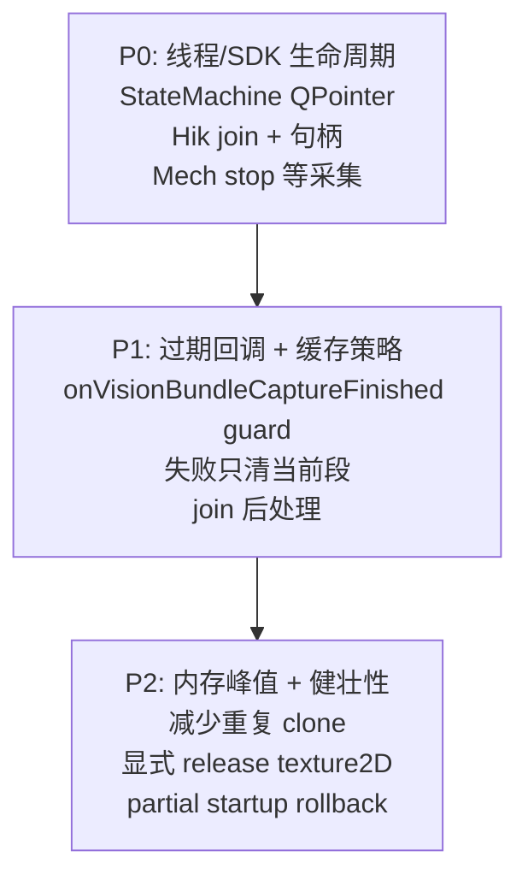

# 主流程代码审查报告

> **审查日期**：2026-05-26  
> **审查范围**：`StateMachine` 扫描主链路、`VisionPipelineService` 组合采集、Mech-Eye / 海康 A/B 相机服务、内存缓存与异步线程  
> **审查重点**：内存泄漏、程序崩溃等高优先级风险

---

## 总体结论

**未发现典型的 `shared_ptr` 永久泄漏**（缓存有上限、检测后会 `resetScanSegmentCache()`）。

**高风险集中在异步生命周期管理**：detached 线程 + 裸 `this`、过期回调未过滤、shutdown 时 SDK 句柄与对象析构竞态。这些在超时、快速重启、进程退出时可能 **崩溃或 PLC 状态错乱**，比纯内存泄漏更紧急。

---

## P0 — 崩溃 / UAF 风险

### 1. StateMachine 后处理线程：Queued 回调可能在析构后执行

**位置**：`modules/flow_control/src/state_machine.cpp`（约 1296–1315 行）

```cpp
StateMachine* self = this;
m_processThread = std::thread(
    [self, input = std::move(input), captureRequestId, segmentIndexCopy, taskId]() mutable {
        // ...
        QMetaObject::invokeMethod(
            self,
            [self, outcome = std::move(outcome)]() mutable {
                self->onSegmentProcessFinished(std::move(outcome));
            },
            Qt::QueuedConnection);
    });
```

**问题**：`joinProcessThreadIfRunning()` 只等 worker lambda 返回，**不保证** Queued 的 `onSegmentProcessFinished` 已执行。`stop()` / `~StateMachine()` 返回后，事件队列里仍可能有一次对已销毁对象的调用。

**对比**：`VisionPipelineService` 已用 `QPointer` 防护（`vision_pipeline_service.cpp` 268–334 行），StateMachine 未对齐。

**建议**：

- worker 内改用 `QPointer<StateMachine>`
- `stop()` 中 join 后处理 pending events，或在 slot 入口检查对象存活

---

### 2. 海康 A/B：detach() + 裸 this，shutdown 时 SDK 句柄 UAF

**位置**：`modules/vision/src/hik_camera_service.cpp`（约 445–487 行）

```cpp
std::thread([this, seedResult, preferredCameraKey, effectiveTimeoutMs]() mutable {
    // ... captureMonoFrame() 阻塞最多数秒 ...
    QMetaObject::invokeMethod(this, [this, seedResult]() { ... }, Qt::QueuedConnection);
}).detach();
```

**问题**：`stop()` 最多等 6 秒，超时后 **强制 `closeDevice()`**（162–166 行），但 detached 线程可能仍在 `MV_CC_GetImageBuffer(handle, ...)` 使用已关闭句柄。

**建议**：

- 可 join 的工作线程 + `QPointer`
- 句柄用 generation / 共享生命周期
- `closeDevice()` 前必须确认采集线程结束

---

### 3. Mech-Eye：stop() 10 秒超时后 delete worker，采集可能仍在 SDK 内

**位置**：`modules/mech_eye/src/mech_eye_service.cpp`（约 105–127 行）

```cpp
if (!m_workerThread->wait(10000)) {
    qCritical(LOG_MECHEYE_SVC) << "Mech-Eye worker 线程未能及时退出。";
}
delete m_worker;
```

**问题**：`CaptureRequest.timeoutMs` 可达 30 秒，`performCapture()` 是阻塞 slot。10 秒 wait 失败后仍 `delete m_worker`，可能与 `capture3D` / `capture2DAnd3DWithNormal` 并发 → SDK 崩溃。

**建议**：

- 采集中设置 in-flight 标志，`stop()` 等待采集结束再 delete
- 或延长 wait + 调用取消采集 API

---

## P1 — 高优先级逻辑 / 稳定性风险

### 4. onVisionBundleCaptureFinished 缺少过期回调防护（当前主路径）

Legacy Mech 路径有完整 guard（`state_machine.cpp` 1764–1768 行）：

```cpp
if (m_activeTask.completionAnnounced || result.requestId != m_activeTask.captureRequestId) {
    return;
}
```

组合采集路径 **只校验 `taskId`**（`state_machine.cpp` 1067–1110 行）：

```cpp
void StateMachine::onVisionBundleCaptureFinished(..., MultiCameraCaptureBundle bundle)
{
    if (!m_activeTask.definition || bundle.request.taskId != m_activeTask.taskId) {
        return;
    }
    // 无 completionAnnounced / captureRequestId / segmentIndex 检查
    applyLbnCalibrationUpdate(...);
    startSegmentProcessAsync(...);
}
```

**问题**：超时后（1719–1731 行）`captureRequestId = 0` 且 `completionAnnounced = true`，但迟到的 bundle 若 `taskId` 仍匹配就会继续执行。

| 后果 | 说明 |
|------|------|
| 标定矩阵被污染 | `applyLbnCalibrationUpdate` 在过期任务上运行 |
| 内存尖峰 | 再次 `cloneCaptureBundle` + 启动 PCL 后处理 |
| 段号错配 | 用 `m_activeTask.scanSegmentIndex`，非 `bundle.request.segmentIndex` |
| 重复写 PLC | `completeActiveTask` **入口无** `completionAnnounced` 检查，过期路径可二次完成 |

**建议**：与 `onCaptureFinished` / `onSegmentProcessFinished` 对齐，至少检查：

- `m_activeTask.completionAnnounced`
- `bundle.request.requestId == m_activeTask.captureRequestId`
- `bundle.request.segmentIndex == m_activeTask.scanSegmentIndex`

---

### 5. 单段失败 / 超时清空全部段缓存

**位置**：`modules/flow_control/src/state_machine.cpp`（约 2641–2644 行）

```cpp
if (resultCode >= 5) {
    resetScanSegmentCache();  // 清空所有已扫段
}
```

超时同样全清（1722–1724 行）。

**问题**：多段扫描中，段 3 失败会丢掉段 1–2 已缓存点云 + 海康帧 + Mech 2D，**综合检测必然失败**。这不是泄漏，但是生产级数据丢失风险。

**建议**：仅清除当前段，或失败时保留已成功段直至 `Trig_ResultReset`。

---

### 6. 超时 / 故障路径未 join 分段后处理线程

`onProcessTimeout`、`onMechEyeFatalError` 会 `resetScanSegmentCache()` 和 `completeActiveTask`，但**不调用** `joinProcessThreadIfRunning()`。

Worker 仍跑 PCL + 深拷贝 bundle，叠加 P4 的过期 bundle 回调，峰值内存可翻倍。

---

### 7. VisionPipelineService::finishBundleIfReady — detached LB/LBN 线程

**位置**：`modules/vision/src/vision_pipeline_service.cpp`（约 347 行）

```cpp
}).detach();
```

**问题**：`stop()` 只清 `m_pending` / `m_processing`，**不 join** 处理线程。`QPointer` 避免了 emit 时 UAF，但：

- shutdown 时 `bundleCaptureFinished` 可能永远不到 → StateMachine 挂起
- `stop()` 后仍可能与新 `requestCaptureBundle` 重叠

**建议**：像 StateMachine 一样用 joinable `m_processThread`。

---

### 8. 组合采集部分启动失败 → 孤儿 in-flight 请求

**位置**：`modules/vision/src/vision_pipeline_service.cpp`（约 168–191 行）

```cpp
pending.mechRequestId = m_mechEyeService->requestCapture(...);
// ...
if (pending.hikARequestId == 0) { return 0; }  // Mech 已在飞，m_pending 未设置
```

**问题**：Mech 已启动但 Hik 失败时，`m_pending` 未赋值，后续回调被丢弃，相机 busy 直到超时结束 → **流水线假死**。

**建议**：两阶段提交（三路都 accept 再 commit），或失败时 cancel/rollback。

---

## P2 — 中等风险 / 内存压力

### 9. 同一段点云存两份

`m_segmentCaptureResults` 与 `m_segmentCaptureBundles.mechEyeResult.pointCloud` 各持一份后处理点云（1357–1362 + 151–155 行）。20 段上限下 RAM 可能达数百 MB，OOM 风险高于泄漏。

### 10. 处理链路 3–4 次深拷贝

VisionPipeline detached 线程持有一份 bundle → StateMachine `cloneCaptureBundle` 再拷贝 → 写入缓存再克隆。慢 PCL 时 transient 峰值很高。

### 11. texture2D.pixels 无显式 release

`resetScanSegmentCache` 只 release 点云和海康帧，2D 靠 `QMap::clear()` 析构 `shared_ptr`。当前无泄漏，但不如点云/海康一致。

### 12. 海康 FreeImageBuffer 可能双 free

**位置**：`modules/vision/src/hik_camera_service.cpp`（约 315–336 行）

```cpp
MV_CC_FreeImageBuffer(handle, &pFrameInfo);  // 成功路径已 free
if (frame.isValid()) { return true; }
MV_CC_FreeImageBuffer(handle, &pFrameInfo);  // frame 无效时再次 free
```

`GetImageBuffer` 成功但 `frame.isValid()` 失败时会 double-free。

### 13. start() 未 join 后处理线程

`stop()` 有 join（476 行），`start()`（445–449 行）直接 `resetScanSegmentCache()`，热重启可能竞态。

### 14. m_segmentProcessInFlight 只写不读

声明了原子标志但未用于超时/故障协调，等于 dead code。

### 15. Mech 3D 路径 ConfigManager::instance() 无空检查

**位置**：`modules/mech_eye/src/mech_eye_worker.cpp`（约 343 行）

```cpp
const auto& visionCfg = common::ConfigManager::instance()->visionConfig();
```

配置未就绪时可能空指针崩溃（概率低）。

---

## 做得好的地方

| 方面 | 说明 |
|------|------|
| 缓冲区所有权 | 点云 / 2D / 海康帧用 `shared_ptr<vector>`，跨线程 Qt 信号不深拷贝像素 |
| 显式释放 | `releasePointCloudFrameBuffers` / `releaseHikMonoFrameBuffers` + cache reset |
| 缓存上限 | `kMaxPointCloudCacheSize = 20`，重复段号拒绝 |
| 后处理 stale 过滤 | `onSegmentProcessFinished` 检查 `completionAnnounced` + requestId + segmentIndex |
| Worker 深拷贝 | 后处理线程不碰 live service 缓冲区 |
| 检测后清缓存 | `executeInspectionTask` / `executeResultResetTask` 调用 `resetScanSegmentCache()` |
| VisionPipeline 部分防护 | LBN/LB 线程用 `QPointer` + `m_started` 检查 |
| 退出顺序 | `console_runtime` 先停 HMI/StateMachine，再停 Vision/相机 |

---

## 修复优先级建议



| 优先级 | 动作 |
|--------|------|
| **立即** | `onVisionBundleCaptureFinished` 补齐 stale guard（生产中最易触发） |
| **立即** | StateMachine worker 改 `QPointer`；Hik 停止 detach |
| **本周** | Mech `stop()` 等待 in-flight capture；VisionPipeline join 处理线程 |
| **本周** | 失败/超时改为按段清缓存，而非 `resetScanSegmentCache()` 全清 |
| **排期** | 减少 bundle 深拷贝；partial startup 回滚 |

---

## 涉及文件索引

| 模块 | 主要文件 |
|------|----------|
| 流程控制 | `modules/flow_control/src/state_machine.cpp` |
| 流程控制 | `modules/flow_control/include/scan_tracking/flow_control/state_machine.h` |
| 视觉流水线 | `modules/vision/src/vision_pipeline_service.cpp` |
| 海康相机 | `modules/vision/src/hik_camera_service.cpp` |
| Mech-Eye | `modules/mech_eye/src/mech_eye_service.cpp` |
| Mech-Eye | `modules/mech_eye/src/mech_eye_worker.cpp` |
| 应用入口 | `app/src/console_runtime.cpp` |

---

## 附录：Mech 2D 图内存位置（审查关联项）

Mech 2D 图在内存中的位置（与本次审查中的缓存策略相关）：

- `StateMachine::m_segmentCaptureBundles[段号].mechEyeResult.texture2D`
- `StateMachine::m_segmentCaptureResults[段号].texture2D`

实际像素数据在 `GrayTextureFrame::pixels`（`shared_ptr<vector<uint8_t>>`）。正常扫描流程只存内存，不落盘 PNG；落盘仅在延迟测试路径（`console_runtime.cpp`）写入 `<scanCacheDirectory>/mech_2d/` 子目录。
