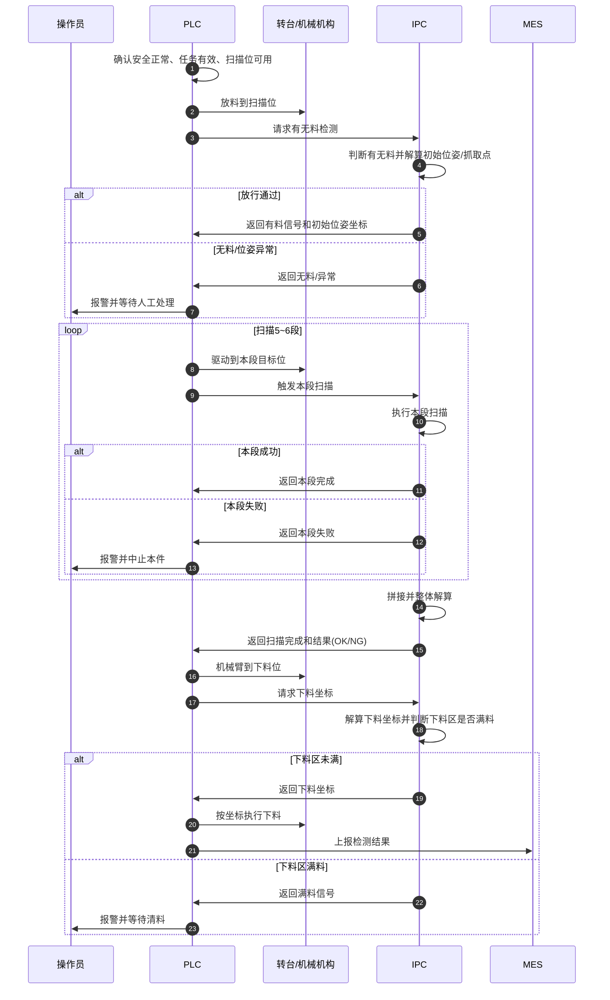

> **IPC 实现说明（2026-05-25）**：下图「扫描 5～6 段」为 PLC/工艺视角；IPC 每段 `Trig_ScanSegment` 落盘至 `ScanTracking_CaptureCache`，**综合检测**时蓝友仅融合 `[Tracking]` 配置的 **3 段**点云（非全部段）。详见 [`多点位扫描与位姿跟踪完整流程.md`](./多点位扫描与位姿跟踪完整流程.md) v1.3。

