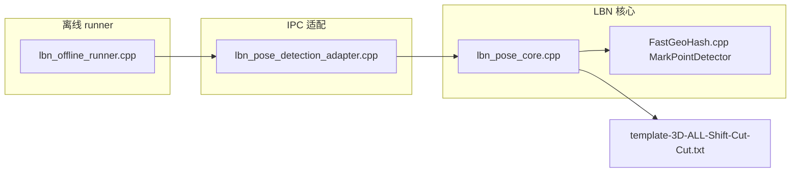

# LBN 离线调通 — AI Agent 交接说明

> **文档目的**：供后续 AI Agent / 开发者快速理解当前进度、已改代码、如何复现 `success=1`，以及下一步工作边界。  
> **最后更新**：2026-05-22  
> **仓库路径**：`D:\work\LY\IPC-192.168.110.173_track-main`

---

## 1. 任务背景与当前结论

### 1.1 用户目标

- 将 **LBN 位姿检测算法** 调通，离线 runner 能看到 **`success=1`**。
- 此前失败主因之一是 **jpg 纹理尺寸与组织化点云网格不一致**；用户已提供 **`texture_aligned.bmp`（2400×1800）** 与 **`textured_point_cloud.ply`** 对齐数据。

### 1.2 当前状态（请务必以此为准）

| 数据集 | 路径 | 离线 `success=1` | 说明 |
|--------|------|------------------|------|
| **150200（主验收）** | `testdata/test/scan_000_20260514_150200_*` | **是** | 13 个 2D 圆心、13 个 3D 提升、官方模板匹配 `matchedPointCount=3` |
| 145026 | `testdata/test/scan_000_20260514_145026_*`（PLY 与 group1 相同） | **否** | 仅 3 个 2D 圆心，2/3 落在点云 NaN 区，3D 提升不足 |
| group1 / group2 | `testdata/group1`、`testdata/group2` | **否** | 仅有缩略 jpg + PLY，无 `texture_aligned.bmp` |

**结论**：后续默认用 **`150200`** 做 LBN 回归；`145026` 需重新采集或换视角，不是参数能单独修好的问题。

---

## 2. 黄金复现命令（150200）

### 2.1 环境

- **OS**：Windows，MSVC 2019 工具集（工程目录名 `win-msvc2019-qtcore-ninja-debug`）。
- **PATH**（运行 exe 前必须加）：
  - `C:\Qt\5.15.2\msvc2019_64\bin`
  - `third_party/LB/opencv-3.4.3-vc14_vc15/opencv/build/x64/vc15/bin`

### 2.2 构建 offline runner

```bat
call "C:\Program Files\Microsoft Visual Studio\18\Community\VC\Auxiliary\Build\vcvars64.bat" -vcvars_ver=14.29
cd /d D:\work\LY\IPC-192.168.110.173_track-main\build\win-msvc2019-qtcore-ninja-debug
ninja scan_tracking_lbn_offline_runner
```

> 注意：必须用 **`-vcvars_ver=14.29`**，否则 VS 18 默认 STL 与工程 cl 版本不匹配会编译失败。

### 2.3 运行（已写入默认参数，可直接跑）

```powershell
$root = "D:\work\LY\IPC-192.168.110.173_track-main"
$env:PATH = "C:\Qt\5.15.2\msvc2019_64\bin;$root\third_party\LB\opencv-3.4.3-vc14_vc15\opencv\build\x64\vc15\bin;" + $env:PATH
$exe = "$root\build\win-msvc2019-qtcore-ninja-debug\modules\vision\scan_tracking_lbn_offline_runner.exe"

& $exe `
  -i "$root\testdata\test\scan_000_20260514_150200_texture_aligned.bmp" `
  -p "$root\testdata\test\scan_000_20260514_150200_textured_point_cloud.ply" `
  --save-debug-image "$root\testdata\test\markers_150200_debug.jpg"
```

**期望输出关键字**：

- `Raw marker candidates before DBSCAN: 17`（约，允许小幅波动）
- `Count of 2D marker centers: 13`
- `3D 提升数量: 13`
- `success=1`
- `matchedPointCount=3`（≥3 即可通过 `Get_Track_Pose`）
- **退出码 `0`**

读 PLY 约 **30s**，整轮约 **40s**。

---

## 3. 已验证可用的 LBN 参数

已同步到 **`config.ini` `[LbnPose]`**、**`config_manager.cpp` 默认值**、**`lbn_offline_runner.cpp` 的 `defaultLbnConfig()`**。

| 参数 | 值 | 作用 |
|------|-----|------|
| `minDistance` | **20** mm | GeoHash 三角形最小边长（原 30 过严） |
| `maxDistance` | 650 mm | 不变 |
| `cosTolerance` | **0.05** | 角度余弦投票容差（原 0.015） |
| `minPercent` | **0.2** | 投票占比阈值 |
| `cloudSearchRadiusPx` | 20 | 2D→3D 插值半径，与 `main.cpp` 一致 |
| `markerMinArea` | **200** | 标记点最小轮廓面积 |
| `markerMaxArea` | 30000 | 不变 |
| `markerIntensityThreshold` | **40** | 暗斑亮度上限（原硬编码 50） |
| `markerDebscanDistPx` | **120** | DBSCAN 去重像素距离（原 300） |

**模板文件（勿删路径）**：

`third_party/LBN/data/template-3D-ALL-Shift-Cut-Cut.txt`（约 68 个 3D 模板点）

---

## 4. 本轮代码改动清单（交接时未单独 commit）

后续 Agent 做 PR / commit 时可按模块拆分。

### 4.1 算法核心 `third_party/LBN/`

| 文件 | 改动要点 |
|------|----------|
| `FastGeoHash.cpp` | **修复 `getResult()`**：原实现要求 `maxV>=6` 且忽略 `minPercent`，导致 7～10 个点永远匹配失败；改为按 `minPercent` 占比 + 放宽绝对票数。 |
| `FastGeoHash.h` / `FastGeoHash.cpp` | `MarkPointDetector::Config` 增加 `intensityThreshold`、`debscanFilterDistPx`；打印 `Raw marker candidates before DBSCAN`。 |
| `lbn_pose_core.h` / `.cpp` | `Config` 增加 `markerMinArea/MaxArea/Intensity/Debscan`；`detectMarkerCenters2d` 透传检测参数。 |

### 4.2 IPC 集成层

| 文件 | 改动要点 |
|------|----------|
| `modules/vision/src/lbn_pose_detection_adapter.cpp` | `toCoreConfig()` 映射新增 marker 字段。 |
| `modules/vision/tests/lbn_offline_runner.cpp` | 默认参数改为 150200 验证集；新增 CLI：`--min-distance`、`--cos-tolerance`、`--marker-min-area`、`--marker-intensity`、`--debscan-dist`、`--save-debug-image`、`--bootstrap-template` 等。 |
| `common/include/scan_tracking/common/config_manager.h` | `LbnPoseConfig` 扩展 marker 字段。 |
| `common/src/config_manager.cpp` | 读写 `[LbnPose]` 新字段，默认值与上一致。 |
| `config.ini` | `[LbnPose]` 更新为可用参数。 |

### 4.3 未改 / 仅阅读

- `modules/hmi_server/src/hmi_tcp_server.cpp`（git 显示有本地修改，与 LBN 调通无直接关系，交接前请 `git status` 确认）。
- 全量多路径状态机 §2.2.1 仍未完成（见 `docs/项目未完成事项清单_v1.0.md`）。

---

## 5. 失败模式速查（排障树）

```
离线 runner
├─ 退出码 0xC0000135 → PATH 缺 Qt / OpenCV DLL
├─ 退出码 3 → PLY 解析失败（宽高推断、vertex 数量）
├─ 退出码 4 → 纹理尺寸 ≠ 点云网格（勿用缩略 jpg，用 texture_aligned.bmp）
├─ success=0, message 含 "Less than 3 valid 3D"
│   └─ 2D 有、3D 少 → 圆心落在 PLY NaN 区（见 145026）；用 Python 在 PLY 该 UV 采样验证
├─ success=0, "Template Matching is not Enough: N" (N<3)
│   ├─ N=0 → 检测到的 3D 几何与模板不匹配，或 getResult 过严（已修，需重编译）
│   └─ N=1~2 → 放宽 cosTolerance / minPercent / marker 检测参数（见 §3）
└─ success=1 → 链路正常
```

**区分两类失败**（文档 `算法使用API.md` §14.7 亦有）：

1. **检测/提升问题**：有 `Count of 2D` 但 `3D 提升数量 < 3`
2. **GeoHash 匹配问题**：3D 够但 `Template Matching is not Enough`

---

## 6. 测试数据目录说明

```
testdata/
├── test/                          ← 用户当前主目录
│   ├── scan_000_20260514_150200_texture_aligned.bmp   # 2400×1800，验收用
│   ├── scan_000_20260514_150200_textured_point_cloud.ply
│   ├── scan_000_20260514_145026_*                     # 同 group1 PLY，不推荐验收
│   ├── markers_150200_debug.jpg                       # 标注 2D 圆心调试图
│   └── detected_template_150200.txt                   # bootstrap 自测模板（可选）
├── group1/   # 仅 jpg + 145026 PLY
└── group2/   # 仅 jpg + 152110 PLY
```

**数据格式要求**（与 `third_party/LBN/main.cpp` 对齐）：

- PLY：ASCII，组织化 `2400×1800=4320000` vertex，无效点 **quiet_NaN**（非 0）
- 纹理：优先 `*texture_aligned*.bmp`，**禁止**依赖缩略 jpg（可用 `--allow-resize-texture` 仅作对比）

---

## 7. 离线 runner 新增 CLI（调参用）

```text
scan_tracking_lbn_offline_runner.exe -i <bmp> -p <ply> [选项]

GeoHash:
  --min-distance <mm>    --max-distance <mm>
  --cos-tolerance <val>  --min-percent <val>
  --cloud-radius <px>

2D 检测:
  --marker-min-area <px>  --marker-max-area <px>
  --marker-intensity <0-255>  --debscan-dist <px>

调试:
  --save-debug-image <path>     # 在纹理图上画圆心
  --bootstrap-template <path>     # 主模板失败后，用本次 3D 写临时模板再匹配（验证链路用）

扩展（非 main 默认）:
  --texture-from-ply  --allow-resize-texture  --legacy-zero-nan
```

**`--bootstrap-template`**：主模板失败时，把本次提升的 3D 点写入 txt 再跑 `estimateFrom3d`，可稳定得到 `bootstrap success=1`；**不能代替**官方模板验收，仅证明 adapter + Estimator 链路通。

---

## 8. 架构速览（避免 Agent 找错文件）



- **业务入口**：`runLbnPoseDetection()`（`modules/vision/include/.../lbn_pose_detection_adapter.h`）
- **在线流水线**：`vision_pipeline_service.cpp` 在 `needMechEye2D` 点位调用上述 adapter（转动点 2D+3D + LBN）
- **算法源码**：`third_party/LBN/`（与评估报告中的 `lbn_pose_adapter.*` 命名不同，以仓库为准）

---

## 9. 已知问题与建议后续工作

### 9.1 已完成（本交接）

- [x] 150200 + 官方模板离线 `success=1`
- [x] 修复 `FastGeoHash::getResult` 投票逻辑
- [x] 检测参数可配置并写入 `config.ini`
- [x] 离线 runner 调参 CLI + 调试图导出

### 9.2 建议下一步（按优先级）

1. **主程序联调**：重新编译 `scan-tracking.exe`，相机或回放 Mech-Eye 采集，确认 `segmentIndex=1/5/8`（`needRotation`）点位 `bundle.lbnPoseResult.success`。
2. **更新文档**：将 §3 参数与 §2 命令同步进 `docs/算法使用API.md` §14.7（当前仍写旧默认 `--group testdata/group1`）。
3. **清单勾选**：`docs/项目未完成事项清单_v1.0.md` §2.3.1 离线 runner 可标为已验证（注明数据集 150200）。
4. **145026 / 新采集**：若需第二组 golden，保证 FOV 内标记点 **3D 间距** 与模板一致（模板点间距约 30～420mm）；采集时导出 `texture_aligned.bmp` + PLY。
5. **未做的大项**：全量多路径调度 §2.2.1、路径级 T0 重置、HMI 展示 LBN 结果等（见 [`项目未完成事项清单_v1.0.md`](./项目未完成事项清单_v1.0.md) §三；HMI 基础通信见 [`HMI开发交接说明.md`](./HMI开发交接说明.md)）。

### 9.3 现场注意

- 模板与 **扫描头物理标记布局** 绑定；换工装/标记需重建 `template-*.txt`。
- 仅检测到局部 7 个点且 3D 簇集在 ~60mm 内时，即使用旧参数也难匹配全模板；150200 调到 13 个点后才成功。

---

## 10. 相关文档索引

| 文档 | 用途 |
|------|------|
| `docs/算法使用API.md` §14 | LBN API、离线 runner 原始说明 |
| `docs/项目未完成事项清单_v1.0.md` §2.3.1 | LBN 接口 / 流水线挂接状态 |
| `docs/多路径扫描代码改动评估报告.md` | 多路径与 LBN 业务集成评估 |
| **本文** `docs/LBN离线调通交接说明.md` | 调通过程、参数、复现、排障 |

---

## 11. 给下一个 Agent 的一句话指令模板

可直接复制为任务提示：

> 在仓库 `IPC-192.168.110.173_track-main` 中，LBN 离线已在 `testdata/test/scan_000_20260514_150200` 上对官方模板调通（`success=1`）。请先阅读 `docs/LBN离线调通交接说明.md`，用 §2 命令复现；若失败检查是否重编译 `lbn_pose` 与 runner。后续优先：主程序 `scan-tracking.exe` 联调、更新 `算法使用API.md`、处理未完成清单 §2.2.1 多路径。不要用 group1 缩略 jpg 做验收。

---

*交接人备注：本轮修改分散在 `third_party/LBN`、`modules/vision`、`common`、`config.ini`；提交前请 `git diff` 全量查看，避免把 `.vs/`、`build/` 误加入版本库。*
