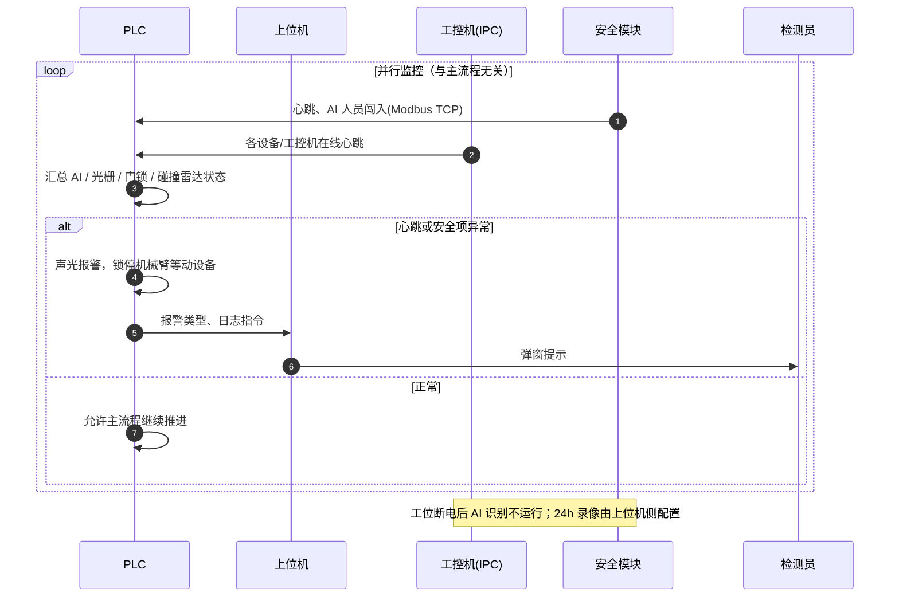

# 2.1 系统安全与并行监控时序

**工位**：兰铀第二工位  
**依据**：`2 工作流程(动作+数据).pdf` §全局安全与监控  
**适用场景**：系统运行期间与主流程并行，周期建议 50~100ms。

```mermaid
sequenceDiagram
    autonumber
    participant P as PLC
    participant H as 上位机
    participant I as 工控机(IPC)
    participant S as 安全模块
    participant O as 检测员

    loop 并行监控（与主流程无关）
        S->>P: 心跳、AI 人员闯入(Modbus TCP)
        I->>P: 各设备/工控机在线心跳
        P->>P: 汇总 AI / 光栅 / 门锁 / 碰撞雷达状态

        alt 心跳或安全项异常
            P->>P: 声光报警，锁停机械臂等动设备
            P->>H: 报警类型、日志指令
            H->>O: 弹窗提示
        else 正常
            P->>P: 允许主流程继续推进
        end
    end

    note over S,I: 工位断电后 AI 识别不运行；24h 录像由上位机侧配置
```
