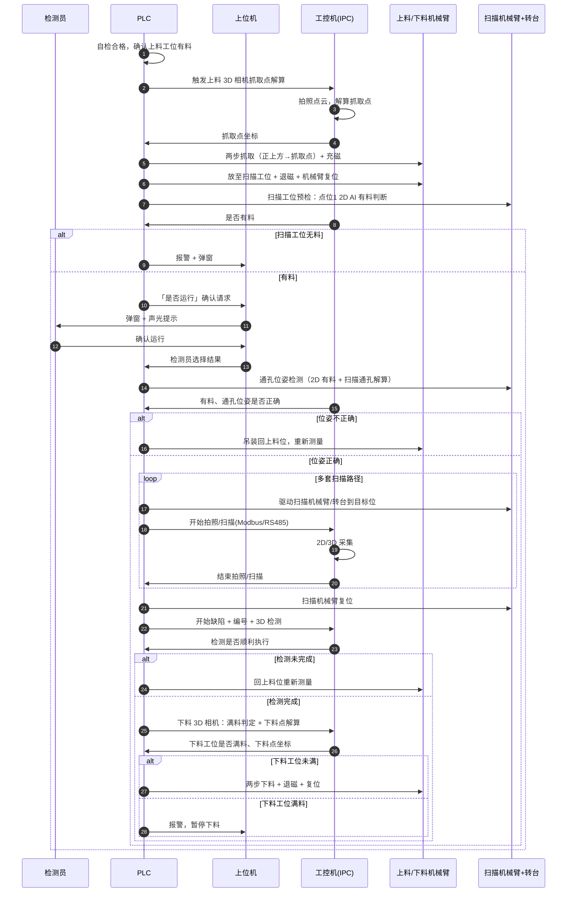

# 2.2 封头模式主流程时序

**工位**：兰铀第二工位  
**工件模式**：`MODE_END_CAP`（封头）  
**依据**：`2 工作流程(动作+数据).pdf` 模式 A  
**适用场景**：机械臂自动上下料；上料 3D 相机 + 下料 3D 相机。

```mermaid
sequenceDiagram
    autonumber
    participant O as 检测员
    participant P as PLC
    participant H as 上位机
    participant I as 工控机(IPC)
    participant R as 上料/下料机械臂
    participant S as 扫描机械臂+转台

    P->>P: 自检合格，确认上料工位有料
    P->>I: 触发上料 3D 相机抓取点解算
    I->>I: 拍照点云，解算抓取点
    I->>P: 抓取点坐标
    P->>R: 两步抓取（正上方→抓取点）+ 充磁
    P->>R: 放至扫描工位 + 退磁 + 机械臂复位

    P->>S: 扫描工位预检：点位1 2D AI 有料判断
    I->>P: 是否有料
    alt 扫描工位无料
        P->>H: 报警 + 弹窗
    else 有料
        P->>H: 「是否运行」确认请求
        H->>O: 弹窗 + 声光提示
        O->>H: 确认运行
        H->>P: 检测员选择结果

        P->>S: 通孔位姿检测（2D 有料 + 扫描通孔解算）
        I->>P: 有料、通孔位姿是否正确
        alt 位姿不正确
            P->>R: 吊装回上料位，重新测量
        else 位姿正确
            loop 多套扫描路径
                P->>S: 驱动扫描机械臂/转台到目标位
                P->>I: 开始拍照/扫描(Modbus/RS485)
                I->>I: 2D/3D 采集
                I->>P: 结束拍照/扫描
            end
            P->>S: 扫描机械臂复位

            P->>I: 开始缺陷 + 编号 + 3D 检测
            I->>P: 检测是否顺利执行
            alt 检测未完成
                P->>R: 回上料位重新测量
            else 检测完成
                P->>I: 下料 3D 相机：满料判定 + 下料点解算
                I->>P: 下料工位是否满料、下料点坐标
                alt 下料工位未满
                    P->>R: 两步下料 + 退磁 + 复位
                else 下料工位满料
                    P->>H: 报警，暂停下料
                end
            end
        end
    end
```
