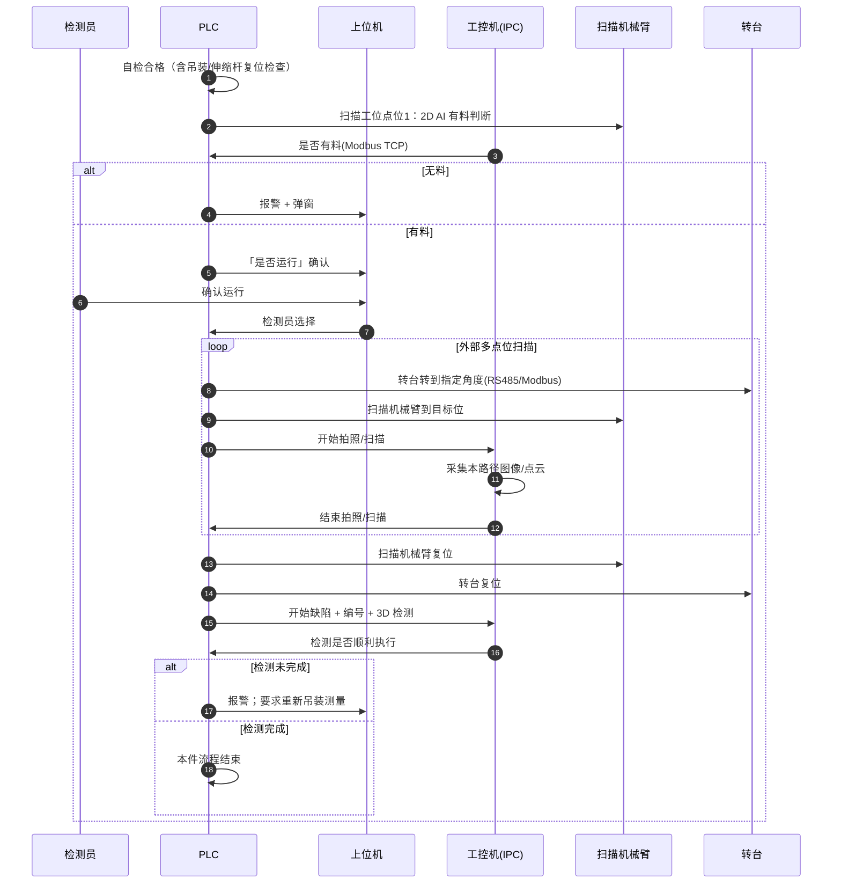

# 2.3 吊装模式扫描与综合检测时序

**工位**：兰铀第二工位  
**工件模式**：`MODE_CYLINDER_SEMI` / `MODE_SEMI_FINISHED`（圆筒半成品、半成品·成品）  
**依据**：`2 工作流程(动作+数据).pdf` 模式 B/C 主扫描段  
**说明**：两种模式共用「扫描工位有料 → 多路径扫描 → 综合检测」框架；圆筒模式在 2.4 中补充伸缩杆内部扫描。

