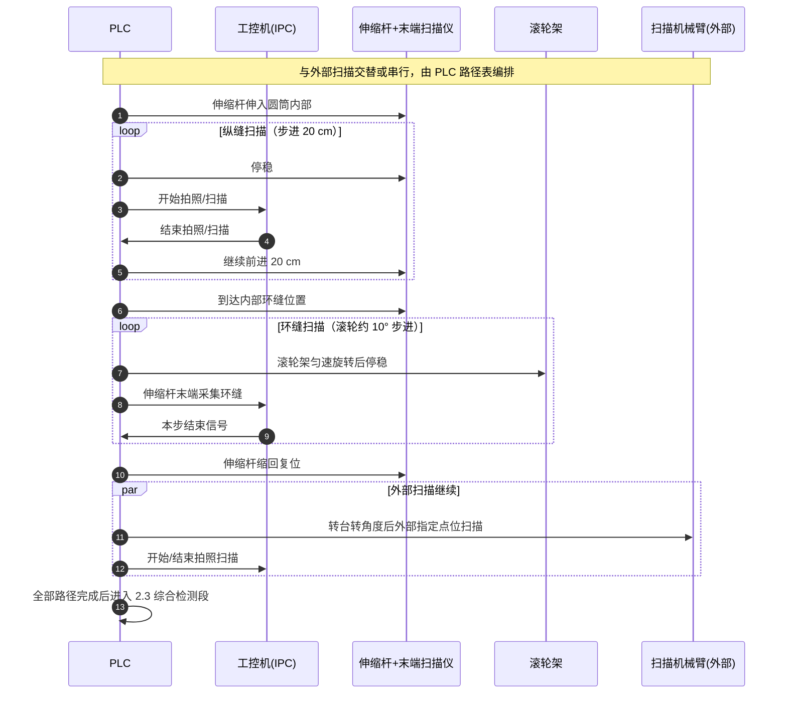

# 2.4 圆筒伸缩杆内部扫描时序

**工位**：兰铀第二工位  
**工件模式**：`MODE_CYLINDER_SEMI`（圆筒半成品）  
**依据**：`2 工作流程(动作+数据).pdf` 模式 B §内部扫描  
**适用场景**：与 2.3 外部扫描配合；成品模式无伸缩杆/滚轮架，不适用本图。

```mermaid
sequenceDiagram
    autonumber
    participant P as PLC
    participant I as 工控机(IPC)
    participant E as 伸缩杆+末端扫描仪
    participant W as 滚轮架
    participant S as 扫描机械臂(外部)

    note over P,S: 与外部扫描交替或串行，由 PLC 路径表编排

    P->>E: 伸缩杆伸入圆筒内部
    loop 纵缝扫描（步进 20 cm）
        P->>E: 停稳
        P->>I: 开始拍照/扫描
        I->>P: 结束拍照/扫描
        P->>E: 继续前进 20 cm
    end

    P->>E: 到达内部环缝位置
    loop 环缝扫描（滚轮约 10° 步进）
        P->>W: 滚轮架匀速旋转后停稳
        P->>I: 伸缩杆末端采集环缝
        I->>P: 本步结束信号
    end

    P->>E: 伸缩杆缩回复位

    par 外部扫描继续
        P->>S: 转台转角度后外部指定点位扫描
        P->>I: 开始/结束拍照扫描
    end

    P->>P: 全部路径完成后进入 2.3 综合检测段
```
