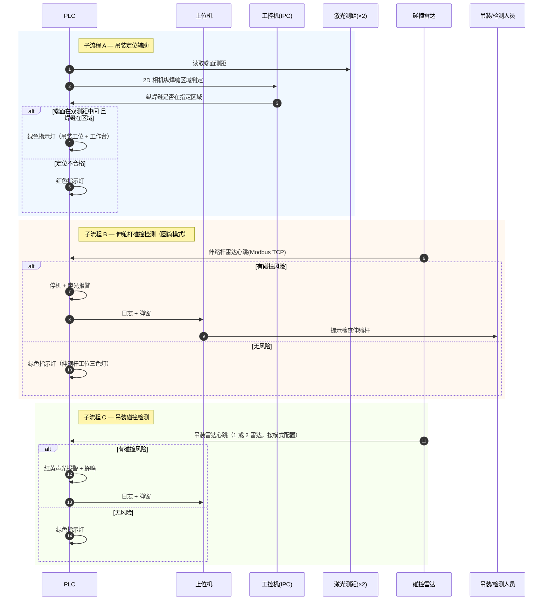

# 2.5 吊装辅助与碰撞监测时序

**工位**：兰铀第二工位  
**依据**：`2 工作流程(动作+数据).pdf` 模式 B/C 辅助子流程  
**适用场景**：吊装定位、伸缩杆防碰、吊装防碰；与主流程并行或作为吊装前门禁。

```mermaid
sequenceDiagram
    autonumber
    participant P as PLC
    participant H as 上位机
    participant I as 工控机(IPC)
    participant L as 激光测距(×2)
    participant C as 碰撞雷达
    participant O as 吊装/检测人员

    rect rgb(240, 248, 255)
        note right of P: 子流程 A — 吊装定位辅助
        P->>L: 读取端面测距
        P->>I: 2D 相机纵焊缝区域判定
        I->>P: 纵焊缝是否在指定区域
        alt 端面在双测距中间 且 焊缝在区域
            P->>P: 绿色指示灯（吊装工位 + 工作台）
        else 定位不合格
            P->>P: 红色指示灯
        end
    end

    rect rgb(255, 248, 240)
        note right of P: 子流程 B — 伸缩杆碰撞检测（圆筒模式）
        C->>P: 伸缩杆雷达心跳(Modbus TCP)
        alt 有碰撞风险
            P->>P: 停机 + 声光报警
            P->>H: 日志 + 弹窗
            H->>O: 提示检查伸缩杆
        else 无风险
            P->>P: 绿色指示灯（伸缩杆工位三色灯）
        end
    end

    rect rgb(248, 255, 240)
        note right of P: 子流程 C — 吊装碰撞检测
        C->>P: 吊装雷达心跳（1 或 2 雷达，按模式配置）
        alt 有碰撞风险
            P->>P: 红黄声光报警 + 蜂鸣
            P->>H: 日志 + 弹窗
        else 无风险
            P->>P: 绿色指示灯
        end
    end
```
