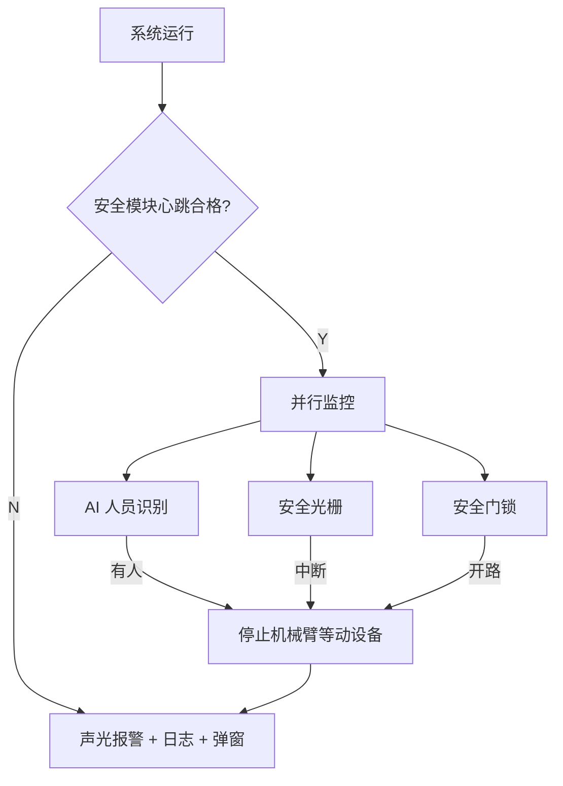
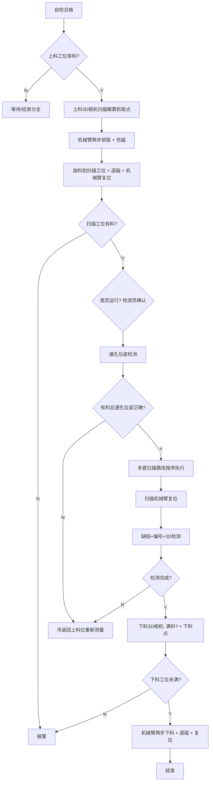
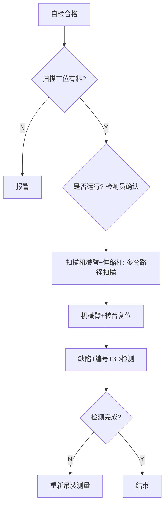
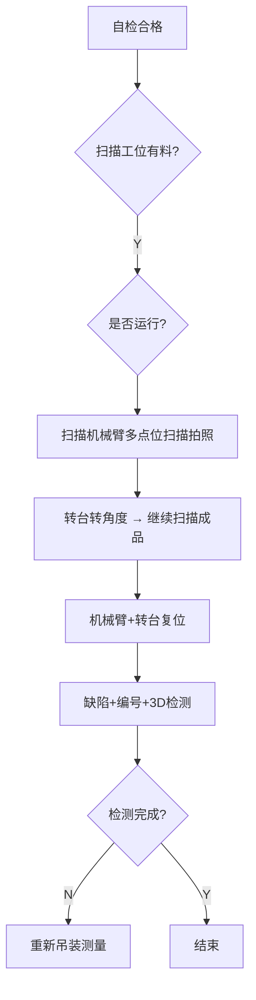

# 兰铀第二工位 — 工作流程（动作 + 数据）AI Agent 参考文档

> **文档来源**：`2 工作流程(动作+数据).pdf`（共 3 页）  
> **仓库路径**：`docs/station2/工作流程-AI-Agent参考.md`（自 `D:\work\兰铀\第二工位\文档` 迁入）  
> **用途**：供 AI Agent / 自动化系统理解第二工位的流程编排、设备职责、通信协议与异常处理。  
> **最后整理**：2026-06-09

---

## 0. 元信息（Agent 快速索引）

| 字段 | 值 |
|------|-----|
| 工位名称 | 兰铀第二工位 |
| 控制核心 | PLC（流程编排） + 上位机（人机交互/日志） + 工控机（视觉/AI/解算） |
| 主通信协议 | Modbus TCP（多数交互）、RS485（部分扫描/转台） |
| 并行安全监控 | AI 人员识别、安全光栅、安全门锁、安全模块心跳 |
| 工件模式数 | 3 种（封头 / 圆筒半成品 / 半成品·成品） |

### 0.1 三种工件模式对照

| 模式 ID | 工件 | 页码 | 上下料方式 | 特有设备 |
|---------|------|------|------------|----------|
| `MODE_END_CAP` | 封头 | 1 | 上下料机械臂 + 电磁吸盘 | 上料 3D 相机、下料 3D 相机 |
| `MODE_CYLINDER_SEMI` | 圆筒半成品 | 2 | 吊装 | 伸缩杆、滚轮架、2×吊装碰撞雷达 |
| `MODE_SEMI_FINISHED` | 半成品/成品 | 3 | 吊装 | 1×吊装碰撞雷达（无伸缩杆） |

---

## 1. 系统角色与职责

### 1.1 PLC

- 主流程状态机驱动（顺序控制各设备动作）
- 下发拍照/扫描/检测/机械臂运动指令
- 汇总设备在线心跳、位置状态、报警信号
- 触发声光报警；向上位机发送弹窗/日志指令
- 「是否运行」节点：弹窗提示检测员选择

### 1.2 上位机

- 安全配置（默认启用 AI 监控、光栅、门锁检测）
- 记录日志、弹窗提示检测员
- 检测员可**忽略自检不通过**（避免影响生产）
- 接收 PLC 的报警与状态信息

### 1.3 工控机（可能多台，文中出现工控机 1 等）

- 2D/3D 图像采集后的 AI 识别与几何解算
- 抓取点、通孔位姿、下料点坐标计算
- 缺陷检测、编号检测、3D 检测
- 碰撞检测/吊装辅助结果反馈
- 向 PLC 回传：是否有料、位姿是否正确、检测是否顺利、结束拍照/扫描信号

### 1.4 安全模块

- 心跳检测
- AI 人员闯入识别（24h 录像；**工位断电后 AI 不运行**）
- 安全光栅中断检测
- 安全门锁开路检测
- 激光雷达碰撞检测（模式相关）

---

## 2. 全局安全与监控（所有模式并行）



### 2.1 安全相关数据流

| 序号 | 方向 | 协议 | 输入数据 |
|------|------|------|----------|
| S1 | 安全模块 → PLC | Modbus TCP | 心跳、有无人员闯入 |
| S2 | 工控机/PLC/设备 → PLC | Modbus TCP / RS485 | 各设备心跳（在线状态） |
| S3 | PLC 汇总 | Modbus TCP | 各设备 ID、是否有警报（AI/光栅/门锁） |
| S4 | 碰撞检测 → PLC → 上位机 | Modbus TCP | 警报类型、有无报警（模式相关） |

### 2.2 安全触发后的标准动作

1. 声光报警
2. 记录日志
3. 软件弹窗提示
4. 停止机械臂等运动设备（光栅/门锁/人员闯入时）

---

## 3. 设备自检（所有模式共有框架）

### 3.1 自检流程

```
开始
  → 安全模块正常工作？心跳合格？
  → 各工控机/PLC/连接设备在线？（心跳）
  → 扫描仪与 3D 相机自检
  → 设备位置复位检查（模式相关设备列表）
  → 检测流程未执行？（防止重复/冲突）
  → 自检合格 → 进入主流程
  → 不合格 → 声光报警 + 日志 + 弹窗（检测员可忽略）
```

### 3.2 扫描仪自检数据流

| 步骤 | 控制方 | 动作 | 协议 | 数据 |
|------|--------|------|------|------|
| 1 | PLC | 控制扫描机械臂带扫描仪到若干固定点位 | Modbus TCP | 扫描指令（输出） |
| 2 | 工控机 | 扫描标记点并解算 | — | — |
| 3 | 工控机 → PLC | 回传自检结果 | Modbus TCP | 是否合格（输入） |
| 4 | 综合判断 | 不合格 → 报警 + 上位机弹窗（可忽略） | — | — |

### 3.3 各模式复位检查对象

| 模式 | 复位检查设备 |
|------|--------------|
| `MODE_END_CAP` | 机械臂、转台、电磁吸盘（退磁）、检测流程未执行 |
| `MODE_CYLINDER_SEMI` | 伸缩杆、机械臂、转台、检测流程未执行 |
| `MODE_SEMI_FINISHED` | 吊装完成、机械臂、转台、检测流程未执行 |

---

## 4. 模式 A：`MODE_END_CAP`（封头）

### 4.1 主流程状态机



### 4.2 逐步动作与数据流

| 步骤 | 动作描述 | 控制 | 协议 | 输出指令 | 输入数据 |
|------|----------|------|------|----------|----------|
| 4 | 上料工位料位 | PLC 读 | Modbus TCP | — | 是否满料 |
| 5 | 扫描工位有料判断（预检） | 扫描机械臂→点位1→2D→AI→复位 | Modbus TCP | 开始/结束拍照 | 是否有料 |
| — | **是否运行** | PLC→上位机弹窗+声光报警，检测员选择 | — | — | 人工确认 |
| 6 | 上料 3D 相机 | PLC 触发拍照，工控机解算抓取点 | Modbus TCP | 抓取点计算指令 | 抓取点坐标 |
| 7 | 上料机械臂抓取 | 先到正上方→再到抓取点→充磁 | PLC 控制 | — | 位置反馈 |
| 8 | 放到扫描工位 | 搬运→放置→退磁→机械臂复位 | PLC 控制 | — | 位置反馈 |
| 9 | 通孔位姿检测 | 点位1：2D AI 有料；点位2：扫描通孔解算 | Modbus TCP | 开始/结束拍照扫描 | 有料、通孔位姿是否正确 |
| 10 | 扫描拍照 | 多点位扫描；转台转角度后继续 | Modbus TCP / RS485 | 开始拍照扫描 | 结束拍照扫描 |
| 11 | 扫描完毕复位 | 全部路径完成后复位 | — | — | — |
| 12 | 缺陷/编号/3D 检测 | PLC 通知工控机执行 | Modbus TCP | 开始检测 | 检测是否顺利执行 |
| 13 | 下料工位检测 | 3D 相机扫描 | Modbus TCP | 开始扫描检测 | 是否满料、下料点坐标 |
| 14 | 机械臂下料 | 到扫描工位固定点→充磁抓取→搬到下料点 | PLC 控制 | — | — |
| 15 | 下料完成 | 退磁 + 复位 | PLC 控制 | — | — |

### 4.3 机械臂运动约定

- **两步抓取/下料**：第一步到正上方，第二步到抓取/放料点
- 运动路径文档注明「可再讨论，已有方案」
- 中途停止：需**手动卸料到原上料位置**，再重启系统

### 4.4 封头模式异常处理

| 场景 | 处理 |
|------|------|
| 任一步检测失败 | 声光报警 + 日志 + 弹窗 |
| 通孔位姿不正确 | 吊装回上料位，重新测量 |
| 检测未完成 | 吊装回上料位，重新测量 |
| 中途停止工作 | 手动卸料回上料位 → 重启 |
| 搬运后暂停，吸盘可能有料 | 人工检查，有料则人工卸料复位 → 搬运后重启 |
| 下料工位满料 | 报警，不继续下料 |

---

## 5. 模式 B：`MODE_CYLINDER_SEMI`（圆筒半成品 + 伸缩杆）

### 5.1 主流程状态机



### 5.2 扫描方式（核心复杂逻辑）

**外部扫描（扫描机械臂）**

- 运动到若干个指定位置，扫描拍照半成品

**内部扫描（伸缩杆）**

1. 伸缩杆带动末端扫描仪/相机伸入圆筒内部
2. **每 20 cm 停一次**，扫描拍照（纵缝检测）
3. 到达内部环缝位置后，滚轮架匀速旋转
4. 滚轮**每约 10° 停一次**，伸缩杆末端扫描仪/相机拍摄（内部环缝）
5. 伸缩杆缩回复位

**转台协同**

- 转台转到指定角度后，扫描机械臂继续外部扫描拍照
- 直至完成所有扫描拍摄任务

> 注：文档注明最终扫描方式可能更复杂、步骤更多。

### 5.3 数据流（与封头模式重叠部分）

| 步骤 | 动作 | 协议 | 输出 | 输入 |
|------|------|------|------|------|
| 5 | 扫描工位有料（2D AI） | Modbus TCP | 开始/结束拍照 | 是否有料 |
| 6 | 扫描拍照（含伸缩杆+转台） | Modbus TCP / RS485 | 开始拍照扫描 | 结束拍照扫描 |
| 11 | 扫描完毕复位 | — | — | 机械臂+转台复位 |
| 12 | 缺陷/编号/3D 检测 | Modbus TCP | 开始检测 | 检测是否顺利 |

### 5.4 辅助子流程：吊装定位

**触发**：辅助吊装设备工作状态检测

**条件链**：

```
心跳合格?
  → 容器端面处于第1和第2激光测距传感器中间?
  → 纵焊缝在2D图像指定区域?
  → 合格: 绿色指示灯 / 不合格: 红色指示灯
```

**设备**：2 个激光测距传感器 + 2D 相机

### 5.5 辅助子流程：伸缩杆碰撞检测

**设备**：伸缩杆激光雷达

**逻辑**：

```
心跳合格?
  → 伸缩杆有碰撞风险?
  → 有风险: 停机检查 + 声光报警 + 日志 + 弹窗
  → 无风险: 绿色指示灯
```

**指示**：伸缩杆工位三色灯（给吊装人员）+ 工作台三色灯（给检测员）

### 5.6 辅助子流程：吊装碰撞检测

**设备**：2 个激光雷达

**逻辑**：

```
心跳合格?
  → 吊装有碰撞风险?
  → 有风险: 红黄声光报警 + 日志 + 弹窗
  → 无风险: 绿色指示灯
```

**指示**：吊装辅助工位 + 工作台三色灯（工作台带蜂鸣器）

### 5.7 圆筒模式异常处理

| 场景 | 处理 |
|------|------|
| 伸缩杆位置不准确 | 人工/自动复位 |
| 吊装不正确 | 重新吊装 |
| 检测未完成 | 重新吊装、重新测量 |
| 中途停止 | 重启检测系统 |
| 暂停设备 | 数据保留；检查伸缩杆/吊装状态 |

---

## 6. 模式 C：`MODE_SEMI_FINISHED`（半成品/成品，无伸缩杆）

### 6.1 主流程状态机

与 `MODE_CYLINDER_SEMI` 类似，但**无伸缩杆/滚轮架内部扫描**：



### 6.2 与模式 B 的差异

| 项目 | 模式 B | 模式 C |
|------|--------|--------|
| 伸缩杆内部扫描 | 有 | 无 |
| 滚轮架环缝扫描 | 有 | 无 |
| 吊装碰撞雷达数量 | 2 | 1 |
| 复位检查 | 含伸缩杆 | 含吊装完成检查 |
| 扫描对象描述 | 半成品 | 半成品 + 成品 |

### 6.3 共有辅助子流程

- 辅助吊装定位（激光测距 + 2D 相机 + 纵焊缝区域）— 同 5.4
- 吊装碰撞检测（1 雷达版）— 逻辑同 5.6，设备数量不同
- 扫描仪自检 — 同 3.2

---

## 7. 关键决策节点（Agent 状态判断）

| 节点 ID | 判断条件 | 真分支 | 假分支 |
|---------|----------|--------|--------|
| `D_SAFE_HB` | 安全模块心跳合格 | 继续 | 报警停机 |
| `D_DEVICE_ONLINE` | 各设备心跳在线 | 继续 | 报警 |
| `D_SELF_CHECK` | 扫描仪/3D 相机自检合格 | 继续 | 报警（可忽略） |
| `D_RESET_OK` | 机械臂/转台/吸盘或伸缩杆复位正确 | 继续 | 报警/复位 |
| `D_HAS_MATERIAL_LOAD` | 上料工位有料（仅封头） | 继续上料 | 等待 |
| `D_HAS_MATERIAL_SCAN` | 扫描工位有料（2D AI） | 继续 | 报警 |
| `D_OPERATOR_RUN` | 检测员确认是否运行 | 继续检测 | 暂停/等待 |
| `D_HOLE_POSE_OK` | 有料且通孔位姿正确（仅封头） | 继续扫描 | 回上料重测 |
| `D_SCAN_DONE` | 所有扫描路径完成 | 进入检测 | 继续扫描 |
| `D_INSPECT_OK` | 缺陷/编号/3D 检测完成且顺利 | 下料或结束 | 回上料/重新吊装 |
| `D_UNLOAD_NOT_FULL` | 下料工位未满（仅封头） | 下料 | 报警 |
| `D_HOIST_ALIGN` | 容器端面在测距中间且纵焊缝在区域 | 绿灯 | 红灯 |
| `D_COLLISION` | 伸缩杆/吊装无碰撞风险 | 绿灯 | 报警停机 |

---

## 8. 通信协议速查表

### 8.1 Modbus TCP 信号汇总

| 信号类别 | 典型输出方 | 典型输入方 | 数据内容 |
|----------|------------|------------|----------|
| 安全心跳 | 安全模块 | PLC | 心跳、人员闯入 |
| 设备在线 | 各设备/工控机 | PLC | 心跳 |
| 设备位置 | 机械臂/转台/吸盘/伸缩杆 | PLC | 位置状态 |
| 料位 | 传感器/AI | PLC | 是否满料、是否有料 |
| 拍照触发 | PLC | 相机/工控机 | 开始/结束拍照 |
| 扫描触发 | PLC | 扫描仪/工控机 | 开始/结束扫描 |
| 解算结果 | 工控机 | PLC | 抓取点、孔位、下料点、是否合格 |
| 检测触发 | PLC | 工控机 | 开始检测 |
| 检测结果 | 工控机 | PLC | 是否顺利执行 |
| 报警 | PLC | 上位机/声光 | 警报类型、日志、弹窗 |

### 8.2 RS485 使用场景

- 扫描机械臂扫描拍照流程（与 Modbus TCP 协同）
- 转台控制
- 部分设备心跳/在线检测

---

## 9. 人机交互规则（Agent 需遵守）

1. **是否运行**：PLC 触发后，上位机必须弹窗 + 声光报警，等待检测员选择。
2. **自检不通过**：可弹窗提示，检测员可选择**忽略**以继续生产。
3. **中途停止（封头）**：必须手动卸料回原上料位后才能重启。
4. **搬运后暂停（封头）**：检查吸盘是否有料，有则人工卸料复位后再重启。
5. **24h 录像**：持续录像；工位断电后 AI 识别不运行。

---

## 10. 已知待定/优化项

| 项目 | 说明 |
|------|------|
| 机械臂路径 | 文档注明路径方案可再讨论 |
| 扫描步骤 | 实际可能比文档更复杂 |
| 检测时机优化 | 后期可能每项扫描完即开始检测，缩短总时间 |
| 流程执行判断 | 需确认「检测流程未执行」防冲突逻辑的具体实现 |

---

## 11. Agent 实施检查清单

实现或对接本工位时，Agent 应确认：

- [ ] 能解析 PLC 主状态机（按 `MODE_*` 分支）
- [ ] 能处理并行安全监控（不等同于主流程步骤）
- [ ] 能映射所有 Modbus TCP 输入/输出寄存器或点位
- [ ] 能区分「报警」与「可忽略自检」两种弹窗
- [ ] 封头模式：实现两步抓取/下料与中途手动卸料逻辑
- [ ] 圆筒模式：实现伸缩杆 20cm 步进 + 滚轮 10° 步进扫描序列
- [ ] 吊装模式：对接激光测距 + 2D 纵焊缝区域判断
- [ ] 碰撞模式：区分 1 雷达 / 2 雷达配置
- [ ] 检测失败时：正确触发回上料/重新吊装分支
- [ ] 扫描完成信号：每套路径完毕需发信号，全部完成后复位

---

## 12. 术语表

| 术语 | 含义 |
|------|------|
| 封头 | 端部工件，由机械臂自动上下料 |
| 半成品 | 圆筒形未完成工件，通常吊装进入工位 |
| 成品 | 完成件，扫描流程与半成品类似 |
| 扫描工位 | 核心检测工位，工件/fixture 放置处 |
| 伸缩杆 | 伸入圆筒内部的扫描执行机构 |
| 滚轮架 | 驱动圆筒旋转以扫描内部环缝 |
| 转台 | 改变工件角度以完成多角度扫描 |
| 通孔位姿 | 封头上通孔的空间位置与姿态是否正确 |
| 两步抓取 | 机械臂先移动到正上方，再下降到目标点 |

---

*本文档由 PDF 流程图与「动作与数据流」文字说明结构化整理，供 AI Agent 程序化理解与对接开发使用。*
