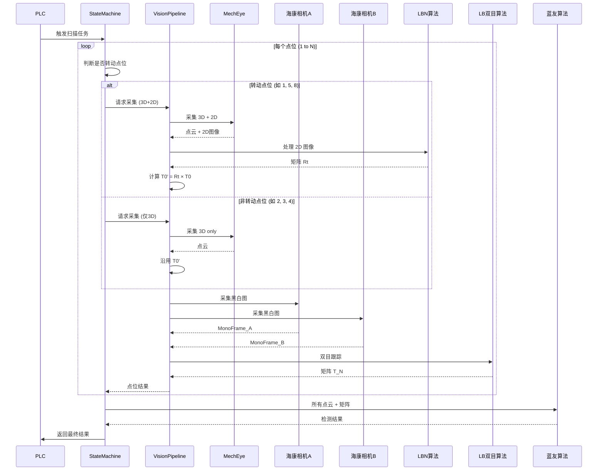
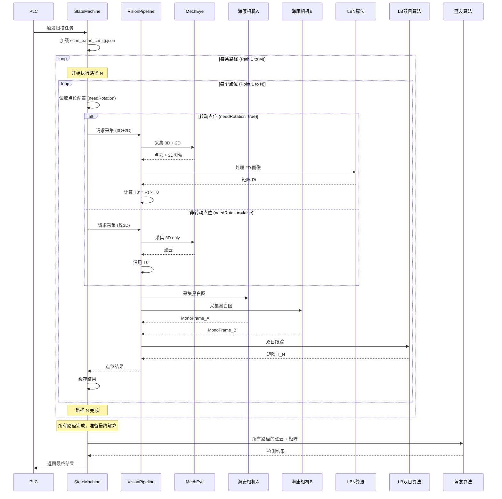

# 多点位扫描与位姿跟踪完整流程

## 概述

本文档描述封头检测工位的完整扫描流程，包括 Mech-Eye 3D 相机、海康双目相机的协同工作，以及多种位姿算法的调用逻辑。

**文档版本**: v1.3（2026-05-25）

> **与代码对齐说明（v1.3）**  
> - **现场默认**：PLC 按段触发 `Trig_ScanSegment`（段数由 `config.ini` `[Tracking] scanSegmentTotal` 配置，上限 16），IPC **不**在单任务内自动跑 `executeMultiPathScanTask()`。  
> - **分段落盘**：每段成功后写入 `ScanTracking_CaptureCache`（详见下文 §「分段采集磁盘缓存」）。  
> - **最终解算**：`Trig_Inspection` 时蓝友仍只消费 **外/内/孔三段** PLY，不是全部扫描段融合。

---

## 系统组成

### 硬件设备
- **Mech-Eye 3D 相机**: 采集 3D 点云 + 2D 彩色/灰度图
- **海康双目相机 A/B**: 采集黑白图像，用于双目立体视觉
- **机械臂 (PLC 控制)**: 带动相机移动到各个点位
- **转盘**: 在特定点位旋转封头，实现多角度扫描

### 算法模块
- **LBN 算法** (新增): 基于 Mech-Eye 2D 图像的位姿估计，输出 4×4 变换矩阵 Rt
- **LB 算法** (双目跟踪): 基于海康双目图像的立体视觉位姿跟踪，输出 4×4 变换矩阵 T
- **蓝友算法** (最终解算): 融合所有点云和位姿矩阵，输出最终检测结果

### 配置文件
- **config.ini**: 系统基础配置（相机连接、超时等）
- **scan_paths_config.json** (新增): 多路径扫描配置文件，包含：
  - 标定矩阵 T0
  - 所有扫描路径定义
  - 每条路径的点位配置（数量、转动与否、转动角度）
  - 路径执行策略
  - 算法参数配置

---

## 核心概念

### 标定矩阵 T0
- **定义**: 预先标定的基准变换矩阵（4×4）
- **作用**: 将 Mech-Eye 相机坐标系转换到机械臂/世界坐标系
- **存储位置**: `calibration.json` 配置文件
- **使用方式**: 
  - 在转盘转动点位，通过 `T0' = Rt × T0` 更新标定矩阵
  - 在非转动点位，沿用上一次的 T0' 或 T0''

### 转盘转动点位
- **定义**: 需要旋转封头以扫描不同角度的点位（如 1 号点、5 号点等）
- **配置**: 在 `calibration.json` 中指定哪些点位需要转动
- **特殊处理**: 转动点位需要额外调用 LBN 算法更新标定矩阵

---

## 完整扫描流程

### 总体流程图

```
PLC 触发扫描任务
    ↓
┌───────────────────────────────────────────────────────────┐
│ 步骤 1: 加载扫描路径配置                                  │
│   - 从 scan_paths_config.json 读取所有路径定义           │
│   - 根据 executionConfig 确定要执行的路径                │
│   - 示例: 执行路径 1 (外圈) + 路径 2 (内圈)              │
└───────────────────────────────────────────────────────────┘
    ↓
┌───────────────────────────────────────────────────────────┐
│ 步骤 2: 循环执行每条路径                                  │
│   外层循环: 路径 1 → 路径 2 → ... → 路径 M               │
└───────────────────────────────────────────────────────────┘
    ↓
    对于每条路径:
    ↓
┌───────────────────────────────────────────────────────────┐
│ 步骤 3: 循环执行路径中的每个点位                          │
│   内层循环: 点位 1 → 2 → 3 → ... → N                     │
└───────────────────────────────────────────────────────────┘
    ↓
    对于每个点位:
    ↓
┌─────────────────────────────────────────────────────────┐
│ 步骤 4: 判断是否为转盘转动点位                          │
│   - 从配置读取 needRotation 标志                        │
│   - 如果 needRotation=true → 执行【转动点位流程】       │
│   - 如果 needRotation=false → 执行【非转动点位流程】    │
└─────────────────────────────────────────────────────────┘
    ↓
所有路径的所有点位扫描完成
    ↓
┌─────────────────────────────────────────────────────────┐
│ 步骤 5: 调用蓝友算法进行最终解算                        │
│   输入: 所有路径的所有点云 + 对应的位姿矩阵             │
│   输出: 封头检测结果（缺陷、尺寸等）                    │
└─────────────────────────────────────────────────────────┘
    ↓
返回结果给 PLC
```

---

## 转动点位流程（如 1 号点、5 号点）

### 流程步骤

```
┌─────────────────────────────────────────────────────────┐
│ 1. 机械臂移动到点位 N                                   │
└─────────────────────────────────────────────────────────┘
    ↓
┌─────────────────────────────────────────────────────────┐
│ 2. Mech-Eye 采集 3D 点云 + 2D 图像                      │
│    - 调用: MechEyeService::requestCapture()            │
│    - 模式: Capture2DAnd3D (同时采集 2D 和 3D)          │
│    - 输出: PointCloud3D + Texture2D                     │
└─────────────────────────────────────────────────────────┘
    ↓
┌─────────────────────────────────────────────────────────┐
│ 3. 调用 LBN 算法（新增）                                │
│    - 输入: Mech-Eye 2D 图像                             │
│    - 输出: 变换矩阵 Rt (4×4)                            │
│    - 算法状态: 待集成（接口预留）                       │
└─────────────────────────────────────────────────────────┘
    ↓
┌─────────────────────────────────────────────────────────┐
│ 4. 更新标定矩阵                                         │
│    - 计算: T0' = Rt × T0                                │
│    - T0: 从 calibration.json 读取的基准标定矩阵         │
│    - T0': 更新后的标定矩阵，用于后续点位                │
└─────────────────────────────────────────────────────────┘
    ↓
┌─────────────────────────────────────────────────────────┐
│ 5. 海康双目相机采集黑白图像                             │
│    - 调用: HikCameraService::requestPoseCapture() × 2  │
│    - 相机 A (左目) + 相机 B (右目)                      │
│    - 输出: MonoFrame_A + MonoFrame_B                    │
└─────────────────────────────────────────────────────────┘
    ↓
┌─────────────────────────────────────────────────────────┐
│ 6. 调用 LB 双目跟踪算法                                 │
│    - 输入: MonoFrame_A + MonoFrame_B                    │
│    - 输出: 变换矩阵 T_N (4×4)                           │
│    - 算法: 立体视觉位姿估计                             │
└─────────────────────────────────────────────────────────┘
    ↓
┌─────────────────────────────────────────────────────────┐
│ 7. 保存本点位结果                                       │
│    - 3D 点云: PointCloud_N                              │
│    - 更新标定矩阵: T0'                                  │
│    - 双目位姿矩阵: T_N                                  │
└─────────────────────────────────────────────────────────┘
```

### 示例：1 号点位（转动点）

| 步骤 | 操作 | 输出 |
|------|------|------|
| 1 | 机械臂移动到 1 号点 | - |
| 2 | Mech-Eye 采集 3D+2D | PointCloud_1 + Texture2D_1 |
| 3 | LBN 算法处理 2D 图 | Rt_1 (4×4 矩阵) |
| 4 | 更新标定矩阵 | T0' = Rt_1 × T0 |
| 5 | 海康双目采集 | MonoFrame_A1 + MonoFrame_B1 |
| 6 | LB 双目跟踪 | T_1 (4×4 矩阵) |
| 7 | 保存结果 | {PointCloud_1, T0', T_1} |

---

## 非转动点位流程（如 2、3、4 号点）

### 流程步骤

```
┌─────────────────────────────────────────────────────────┐
│ 1. 机械臂移动到点位 N                                   │
└─────────────────────────────────────────────────────────┘
    ↓
┌─────────────────────────────────────────────────────────┐
│ 2. Mech-Eye 仅采集 3D 点云                              │
│    - 调用: MechEyeService::requestCapture()            │
│    - 模式: Capture3DOnly (仅采集 3D，不采 2D)          │
│    - 输出: PointCloud3D                                 │
│    - 原因: 转盘未转动，无需重新标定                     │
└─────────────────────────────────────────────────────────┘
    ↓
┌─────────────────────────────────────────────────────────┐
│ 3. 沿用上一次的标定矩阵                                 │
│    - 使用: T0' (来自最近一次转动点位)                   │
│    - 无需调用 LBN 算法                                  │
└─────────────────────────────────────────────────────────┘
    ↓
┌─────────────────────────────────────────────────────────┐
│ 4. 海康双目相机采集黑白图像                             │
│    - 调用: HikCameraService::requestPoseCapture() × 2  │
│    - 输出: MonoFrame_A + MonoFrame_B                    │
└─────────────────────────────────────────────────────────┘
    ↓
┌─────────────────────────────────────────────────────────┐
│ 5. 调用 LB 双目跟踪算法                                 │
│    - 输入: MonoFrame_A + MonoFrame_B                    │
│    - 输出: 变换矩阵 T_N (4×4)                           │
└─────────────────────────────────────────────────────────┘
    ↓
┌─────────────────────────────────────────────────────────┐
│ 6. 保存本点位结果                                       │
│    - 3D 点云: PointCloud_N                              │
│    - 沿用标定矩阵: T0' (无变化)                         │
│    - 双目位姿矩阵: T_N                                  │
└─────────────────────────────────────────────────────────┘
```

### 示例：2 号点位（非转动点）

| 步骤 | 操作 | 输出 |
|------|------|------|
| 1 | 机械臂移动到 2 号点 | - |
| 2 | Mech-Eye 仅采集 3D | PointCloud_2 |
| 3 | 沿用标定矩阵 | T0' (来自 1 号点) |
| 4 | 海康双目采集 | MonoFrame_A2 + MonoFrame_B2 |
| 5 | LB 双目跟踪 | T_2 (4×4 矩阵) |
| 6 | 保存结果 | {PointCloud_2, T0', T_2} |

---

## 完整扫描示例（多路径）

### 配置示例

假设执行 2 条路径：
- **路径 1 (外圈扫描)**: 8 个点位，转动点位为 1, 5, 8
- **路径 2 (内圈扫描)**: 6 个点位，转动点位为 1, 4, 6

### 路径 1 扫描序列（外圈）

| 点位 | 类型 | 转动角度 | Mech-Eye 采集 | LBN 调用 | 标定矩阵 | 海康双目 | LB 调用 | 输出 |
|------|------|----------|---------------|----------|----------|----------|---------|------|
| 1 | 转动 | 0° | 3D + 2D | ✓ | T0_P1' = Rt_1 × T0 | A1 + B1 | ✓ | {PC_P1_1, T0_P1', T_P1_1} |
| 2 | 非转动 | 0° | 3D only | ✗ | T0_P1' (沿用) | A2 + B2 | ✓ | {PC_P1_2, T0_P1', T_P1_2} |
| 3 | 非转动 | 0° | 3D only | ✗ | T0_P1' (沿用) | A3 + B3 | ✓ | {PC_P1_3, T0_P1', T_P1_3} |
| 4 | 非转动 | 0° | 3D only | ✗ | T0_P1' (沿用) | A4 + B4 | ✓ | {PC_P1_4, T0_P1', T_P1_4} |
| 5 | 转动 | 90° | 3D + 2D | ✓ | T0_P1'' = Rt_5 × T0 | A5 + B5 | ✓ | {PC_P1_5, T0_P1'', T_P1_5} |
| 6 | 非转动 | 90° | 3D only | ✗ | T0_P1'' (沿用) | A6 + B6 | ✓ | {PC_P1_6, T0_P1'', T_P1_6} |
| 7 | 非转动 | 90° | 3D only | ✗ | T0_P1'' (沿用) | A7 + B7 | ✓ | {PC_P1_7, T0_P1'', T_P1_7} |
| 8 | 转动 | 180° | 3D + 2D | ✓ | T0_P1''' = Rt_8 × T0 | A8 + B8 | ✓ | {PC_P1_8, T0_P1''', T_P1_8} |

### 路径 2 扫描序列（内圈）

| 点位 | 类型 | 转动角度 | Mech-Eye 采集 | LBN 调用 | 标定矩阵 | 海康双目 | LB 调用 | 输出 |
|------|------|----------|---------------|----------|----------|----------|---------|------|
| 1 | 转动 | 0° | 3D + 2D | ✓ | T0_P2' = Rt_1 × T0 | A1 + B1 | ✓ | {PC_P2_1, T0_P2', T_P2_1} |
| 2 | 非转动 | 0° | 3D only | ✗ | T0_P2' (沿用) | A2 + B2 | ✓ | {PC_P2_2, T0_P2', T_P2_2} |
| 3 | 非转动 | 0° | 3D only | ✗ | T0_P2' (沿用) | A3 + B3 | ✓ | {PC_P2_3, T0_P2', T_P2_3} |
| 4 | 转动 | 120° | 3D + 2D | ✓ | T0_P2'' = Rt_4 × T0 | A4 + B4 | ✓ | {PC_P2_4, T0_P2'', T_P2_4} |
| 5 | 非转动 | 120° | 3D only | ✗ | T0_P2'' (沿用) | A5 + B5 | ✓ | {PC_P2_5, T0_P2'', T_P2_5} |
| 6 | 转动 | 240° | 3D + 2D | ✓ | T0_P2''' = Rt_6 × T0 | A6 + B6 | ✓ | {PC_P2_6, T0_P2''', T_P2_6} |

### 最终解算

```
输入蓝友算法:
  路径 1 数据:
    - 点云列表: [PC_P1_1, PC_P1_2, ..., PC_P1_8]
    - 标定矩阵列表: [T0_P1', T0_P1', T0_P1', T0_P1', T0_P1'', T0_P1'', T0_P1'', T0_P1''']
    - 双目位姿列表: [T_P1_1, T_P1_2, ..., T_P1_8]
  
  路径 2 数据:
    - 点云列表: [PC_P2_1, PC_P2_2, ..., PC_P2_6]
    - 标定矩阵列表: [T0_P2', T0_P2', T0_P2', T0_P2'', T0_P2'', T0_P2''']
    - 双目位姿列表: [T_P2_1, T_P2_2, ..., T_P2_6]

输出:
  - 封头缺陷检测结果（融合所有路径数据）
  - 尺寸测量结果
  - 质量评估报告
```

---

## 配置文件结构

### scan_paths_config.json (新增)

完整配置文件见项目根目录的 `scan_paths_config.json`，以下是关键部分说明：

#### 1. 标定矩阵配置

```json
{
  "calibrationMatrix": {
    "T0": [
      [1.0, 0.0, 0.0, 0.0],
      [0.0, 1.0, 0.0, 0.0],
      [0.0, 0.0, 1.0, 0.0],
      [0.0, 0.0, 0.0, 1.0]
    ],
    "description": "Mech-Eye 相机到机械臂基座的标定变换矩阵 (4x4)"
  }
}
```

#### 2. 扫描路径配置

```json
{
  "scanPaths": [
    {
      "pathId": 1,
      "pathName": "外圈扫描路径",
      "description": "扫描封头外圈区域",
      "enabled": true,
      "totalPoints": 8,
      "points": [
        {
          "pointIndex": 1,
          "pointName": "外圈起点",
          "needRotation": true,
          "rotationAngle": 0,
          "description": "路径起点，需要转盘归零并重新标定"
        },
        {
          "pointIndex": 2,
          "pointName": "外圈点2",
          "needRotation": false,
          "rotationAngle": 0,
          "description": "转盘保持不动，仅采集3D点云"
        }
        // ... 更多点位
      ]
    },
    {
      "pathId": 2,
      "pathName": "内圈扫描路径",
      "enabled": true,
      "totalPoints": 6,
      "points": [
        // ... 点位配置
      ]
    }
    // ... 更多路径
  ]
}
```

#### 3. 执行策略配置

```json
{
  "executionConfig": {
    "executeAllPaths": false,
    "description": "是否执行所有启用的路径",
    "selectedPathIds": [1, 2],
    "pathExecutionOrder": "sequential",
    "allowPathSkipOnError": false
  }
}
```

#### 4. 转盘配置

```json
{
  "turntableConfig": {
    "enabled": true,
    "description": "转盘是否启用，具体转动角度在各点位配置中指定"
  }
}
```

#### 5. 算法配置

```json
{
  "algorithmConfig": {
    "lbn": {
      "enabled": true,
      "timeoutMs": 2000,
      "confidenceThreshold": 0.8
    },
    "lb": {
      "enabled": true,
      "timeoutMs": 1500,
      "minFeaturePoints": 50
    },
    "lanyou": {
      "enabled": true,
      "timeoutMs": 10000,
      "qualityThreshold": 0.7
    }
  }
}
```

---

## 代码实现要点

### 1. 加载扫描路径配置

```cpp
struct ScanPathConfig {
    int pathId;
    QString pathName;
    bool enabled;
    int totalPoints;
    std::vector<ScanPointConfig> points;
};

struct ScanPointConfig {
    int pointIndex;
    QString pointName;
    bool needRotation;
    float rotationAngle;
    QString description;
};

std::vector<ScanPathConfig> loadScanPathsFromConfig() {
    // 从 scan_paths_config.json 读取所有路径配置
    QFile file("scan_paths_config.json");
    // ... JSON 解析逻辑
    return scanPaths;
}
```

### 2. 判断转动点位

```cpp
bool isRotationPoint(const ScanPathConfig& path, int pointIndex) {
    // 从路径配置中查找对应点位
    for (const auto& point : path.points) {
        if (point.pointIndex == pointIndex) {
            return point.needRotation;
        }
    }
    return false;
}
```

### 3. 执行多路径扫描

```cpp
void executeScanTask() {
    // 1. 加载配置
    auto allPaths = loadScanPathsFromConfig();
    auto selectedPathIds = loadExecutionConfig().selectedPathIds;
    
    // 2. 筛选要执行的路径
    std::vector<ScanPathConfig> pathsToExecute;
    for (const auto& path : allPaths) {
        if (path.enabled && selectedPathIds.contains(path.pathId)) {
            pathsToExecute.push_back(path);
        }
    }
    
    // 3. 循环执行每条路径
    for (const auto& path : pathsToExecute) {
        qInfo() << "开始执行路径:" << path.pathName;
        
        // 4. 循环执行路径中的每个点位
        for (const auto& point : path.points) {
            executeScanPoint(path, point);
        }
        
        qInfo() << "路径执行完成:" << path.pathName;
    }
    
    // 5. 调用蓝友算法进行最终解算
    invokeLanyouAlgorithm(allResults);
}
```

### 4. 选择 Mech-Eye 采集模式

```cpp
auto captureMode = point.needRotation
    ? mech_eye::CaptureMode::Capture2DAnd3D   // 转动点：3D + 2D
    : mech_eye::CaptureMode::Capture3DOnly;   // 非转动点：仅 3D
```

### 5. 调用 LBN 算法（单段闭环已实现）

**当前（2026-05-21 v1.2）**：
- `scan_paths_config.json` 中 `pointIndex` 与 PLC `segmentIndex` 对齐时，`needRotation=true` → `requestCaptureBundle(..., needMechEye2D=true)` → Mech-Eye `Capture2DAnd3D` → LBN。
- `StateMachine::applyLbnCalibrationUpdate()`：转动点且 LBN 成功时 `T0' = Rt × T0`；失败则沿用当前矩阵。
- 模板文件：`third_party/LBN/data/template-3D-ALL-Shift-Cut-Cut.txt`。

**尚未实现**：全量多路径循环、路径级 T0 重置（§2.2.1）。

**已实现（单段，勿与下段伪代码混淆）**：`StateMachine::applyLbnCalibrationUpdate()` 在转动段且 LBN 成功时执行 `T0' = Rt × T0`；失败则沿用当前矩阵并打日志。

```cpp
// 多路径目标逻辑（§2.2.1 未实现；单段已在 applyLbnCalibrationUpdate 中实现）
if (point.needRotation) {
    const auto& lbn = bundle.lbnPoseResult;
    if (lbn.success && lbn.poseMatrix.valid) {
        Matrix4x4 T0 = loadCalibrationMatrix();
        m_currentCalibrationMatrix = multiply(lbn.poseMatrix, T0);  // T0' = Rt × T0
    }
}
```

### 6. 结果汇总

```cpp
struct ScanPointResult {
    int pathId;                      // 路径 ID
    int pointIndex;                  // 点位索引
    PointCloudFrame pointCloud;      // 3D 点云
    Matrix4x4 calibrationMatrix;     // T0' 或 T0''
    Matrix4x4 stereoTrackingMatrix;  // T_N (LB 双目跟踪)
};

struct ScanPathResult {
    int pathId;
    QString pathName;
    std::vector<ScanPointResult> pointResults;
};

std::vector<ScanPathResult> allPathResults;
```

---

## 时序图



### 多路径扫描时序图



---

## 关键差异对比

| 特性 | 转动点位 | 非转动点位 |
|------|----------|------------|
| Mech-Eye 采集模式 | 3D + 2D | 仅 3D |
| LBN 算法调用 | ✓ 需要 | ✗ 不需要 |
| 标定矩阵更新 | ✓ 更新 T0' | ✗ 沿用上次 |
| 海康双目采集 | ✓ 需要 | ✓ 需要 |
| LB 双目跟踪 | ✓ 需要 | ✓ 需要 |
| 采集耗时 | 较长（~6秒） | 较短（~5秒） |

---

## 分段采集内存缓存与点云后处理（v1.4）

### 配置

`config.ini [PointCloudProcessing]`：深度裁剪（Z PassThrough）→ 统计离群去除 → MLS 表面平滑 → 体素均匀降采样。总开关 `enabled=false` 时直通原始点云。

相机采集深度仍由 `[Vision] mechDepthRangeMin/Max` 在 SDK 侧设置；后处理深度与之独立，便于现场单独调算法输入。

### 单段 `Trig_ScanSegment` 数据流

```text
PLC Trig_ScanSegment(段号 N)
  → VisionPipeline：Mech-Eye + 海康 + LB（LB 用当次内存图）
  → LBN（若 needRotation）：更新 T0'
  → 后台线程 processPointCloudFrame（PCL 四步）
  → 内存：m_segmentCaptureResults[N]（已处理点云）
         m_segmentCaptureBundles[N]（海康 A/B 帧 + Mech 元数据）
```

### `Trig_Inspection` 与蓝友

- 从 `m_segmentCaptureResults` 按 `[Tracking]` 三个 `segmentIndex` 直接取**已后处理**点云，调用 `TrackingService::inspectSegments` → 蓝友 `runFirstStationDetection`。
- 可缓存多段（≤ `kMaxPointCloudCacheSize`），解算仍用 **3 份点云**（外/内/孔）。
- 复位或检测完成后 `resetScanSegmentCache()` 释放内存；**不再**写分段 PLY/BMP（LatencyTest 调试落盘除外）。

### 与「多路径自动调度」的区别

| 能力 | PLC 按段触发（已实现） | IPC 多路径循环（§2.2.1，未实现） |
|------|------------------------|----------------------------------|
| 段/点推进 | PLC 写 `ScanSegmentIndex` + `Trig_ScanSegment` | IPC 读 `scan_paths_config.json` 双层循环 |
| 缓存 | 按 **段号** 内存 | 设计为按 path/point（未接） |
| 蓝友输入 | 固定 3 段映射 | 设计为多路径融合（未接） |

---

## 待实现功能清单

### 高优先级
- [x] 实现 `scan_paths_config.json` 配置文件读取和解析（`ConfigManager`）
- [ ] 实现多路径扫描调度逻辑（外层路径循环 + 内层点位循环，`executeMultiPathScanTask`）
- [x] 集成 LBN 算法库与 IPC 适配层（`third_party/LBN` + `lbn_pose_detection_adapter`）
- [x] 单段扫描：按 `needRotation` 采集 2D+3D 并更新标定矩阵（`applyLbnCalibrationUpdate`）
- [ ] 全量多路径状态机（§2.2.1）
- [x] 转动点位判断（`segmentIndex` ↔ `needRotation`）
- [x] 单段标定矩阵更新 (T0' = Rt × T0)
- [x] `VisionPipelineService` 动态采集模式（`needMechEye2D`）
- [x] 分段内存缓存（`m_segmentCaptureResults` + `m_segmentCaptureBundles`）
- [x] 可配置点云后处理（`[PointCloudProcessing]` + `point_cloud_processor`）

### 中优先级
- [ ] 实现转盘控制接口（旋转到指定角度、归零等）
- [ ] 集成蓝友多路径点云融合（`detectMultiPath`，非当前 3 段检测）
- [ ] 添加路径和点位扫描进度反馈（百分比、剩余时间）
- [ ] 实现扫描中断与恢复机制（支持路径级别和点位级别）
- [ ] 添加路径执行失败的容错处理（跳过失败路径或重试）
- [ ] 实现配置文件热加载（无需重启程序即可更新路径配置）

### 低优先级
- [ ] 添加标定矩阵可视化工具（3D 坐标系显示）
- [ ] 实现扫描结果回放功能（按路径和点位回放；可先用 `ScanTracking_CaptureCache` 手工回放）
- [x] 优化内存占用（分段落盘 + 释放像素，见 §「分段采集磁盘缓存」）
- [ ] 添加路径规划优化（自动计算最优扫描顺序）
- [ ] 实现扫描数据压缩和归档

---

## 常见问题

### Q1: 为什么需要多条扫描路径？
**A**: 不同的扫描路径覆盖封头的不同区域（外圈、内圈、焊缝等），通过多路径扫描可以实现全面检测，提高检测精度和覆盖率。

### Q2: 为什么转动点位需要采集 2D 图像？
**A**: 转盘转动后，封头的姿态发生变化，需要通过 LBN 算法重新估计相机与封头的相对位姿，更新标定矩阵 T0。

### Q3: 非转动点位为什么不调用 LBN？
**A**: 非转动点位时，转盘未旋转，封头姿态未变，可以沿用上一次转动点位计算的标定矩阵 T0'，节省计算时间。

### Q4: 不同路径的标定矩阵是否独立？
**A**: 是的。每条路径开始时，标定矩阵从基准 T0 开始，在路径内的转动点位会更新为 T0'、T0'' 等，但不同路径之间的标定矩阵互不影响。

### Q5: LB 双目跟踪算法的作用是什么？
**A**: LB 算法通过海康双目相机的立体视觉，实时跟踪封头上的特征点，输出每个点位的精确位姿矩阵 T_N，用于点云配准。

### Q6: 如果 LBN 算法失败怎么办？
**A**: 
- 转动点位：标记为失败，使用上一次的 T0' 继续扫描，并记录警告
- 非转动点位：不受影响，继续使用现有 T0'

### Q8: 如何选择执行哪些路径？
**A**: 在 `scan_paths_config.json` 的 `executionConfig` 中配置：
- `executeAllPaths=true`: 执行所有 `enabled=true` 的路径
- `executeAllPaths=false`: 仅执行 `selectedPathIds` 中指定的路径

### Q9: 路径执行失败后会怎样？
**A**: 根据 `allowPathSkipOnError` 配置：
- `true`: 跳过失败的路径，继续执行下一条路径
- `false`: 整个扫描任务失败，停止执行

### Q10: 多路径扫描的总耗时如何估算？
**A**: 总耗时 ≈ Σ(路径点位数 × 单点位耗时)
- 转动点位耗时: ~6-8 秒（3D+2D 采集 + LBN + 双目 + LB）
- 非转动点位耗时: ~5-6 秒（3D 采集 + 双目 + LB）
- 示例: 2 条路径（8+6 点位），约 70-90 秒

---

## 版本历史

| 版本 | 日期 | 修改内容 |
|------|------|----------|
| 1.0 | 2026-05-19 | 初始版本，定义完整扫描流程 |
| 1.1 | 2026-05-21 | 同步 LBN 视觉流水线接入现状 |
| 1.2 | 2026-05-21 | 路线 A：按点位 LBN + 单段 T0' 更新 |
| 1.3 | 2026-05-25 | 分段落盘 `ScanTracking_CaptureCache`、PLC 按段 vs 多路径区分；刷新待实现清单 |

---

## 参考文档

- [6.11_完整扫描流程时序图.md](./6.11_完整扫描流程时序图.md)
- [封头检测工位PLC-IPC Modbus通信协议_v0.1.md](./封头检测工位PLC-IPC%20Modbus通信协议_v0.1.md)
- [算法使用API.md](./算法使用API.md)
